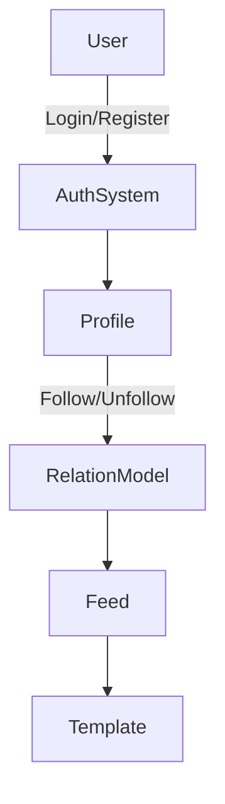

# 🧩 Django Social App

A simple social network built with **Django 5**, featuring user registration with email, following/unfollowing users, and profile management.  
This project is designed for learning and rapid prototyping — it can serve as a solid foundation for larger social applications.

---

## 🚀 Features

- 🔐 Register/Login with Email (Custom User Model)
- 👥 Follow & Unfollow other users (Relation model)
- 🖼 User profile with avatar and bio
- 📨 Post creation and feed display
- ⚙️ Admin panel for managing users and content
- 🔔 Automatic profile creation using Django signals
- 📄 Environment-based configuration via `.env`

---

## 🧱 Project Structure

```
django-social-app/
│
├── account/              # User management (auth, register, login)
├── home/                 # Home feed and posts
├── templates/            # HTML templates
├── static/               # Static files (CSS, JS, images)
├── djangoProject/        # Main settings and configuration
├── .env.example          # Example environment variables
├── requirements.txt      # Python dependencies
└── manage.py             # Django management script
```

---

## ⚙️ Installation & Setup

### 1️⃣ Clone the repository
```bash
git clone https://github.com/sepehrkhastoo/django-social-app.git
cd django-social-app
```

### 2️⃣ Create a virtual environment
```bash
python -m venv venv
source venv/bin/activate      # macOS/Linux
venv\Scripts\activate         # Windows
```

### 3️⃣ Install dependencies
```bash
pip install -r requirements.txt
```

### 4️⃣ Create a `.env` file
Create a `.env` file in the root directory (based on `.env.example`) and set values like:
```bash
DEBUG=True
SECRET_KEY=your_secret_key_here
ALLOWED_HOSTS=127.0.0.1,localhost
EMAIL_BACKEND=django.core.mail.backends.console.EmailBackend
```

### 5️⃣ Apply migrations and run the server
```bash
python manage.py migrate
python manage.py runserver
```

Now visit your app at:
👉 http://127.0.0.1:8000

---

## 🧍‍♂️ Create a Superuser
```bash
python manage.py createsuperuser
```
Then log in at `/admin` to manage users and posts.

---

## 🧩 Running Tests
```bash
python manage.py test
```

(Automated tests and CI will be improved in future releases.)

---

## 🧰 Production Configuration

Before deploying to production:
- Set `DEBUG=False`
- Use a strong, secret key
- Configure `ALLOWED_HOSTS` properly
- Enable HTTPS
- Use a real email backend
- Collect static files:
  ```bash
  python manage.py collectstatic
  ```

---

## 🧠 Architecture Overview



---

## 🤝 Contributing

Contributions are welcome!  
1. Fork the repo  
2. Create a new branch (`feature/my-feature`)  
3. Commit and push your changes  
4. Submit a Pull Request ✅

---

## 📦 Requirements

| Dependency | Recommended Version |
|-------------|----------------------|
| Python | 3.11+ |
| Django | 5.x |
| Pillow | latest |
| python-dotenv | latest |

---

## 🧭 Roadmap

- [ ] Add REST API (Django REST Framework)
- [ ] Add likes & comments for posts
- [ ] Support post image uploads
- [ ] Add automated tests and GitHub Actions CI
- [ ] Add Docker support

---

## 📸 Screenshots

*(Coming soon — demo images and GIFs will be added.)*

---

## 📄 License

This project is licensed under the MIT License — you are free to use, modify, and distribute it.

---

### ✉️ Author
Created by [@sepehrkhastoo](https://github.com/sepehrkhastoo)
